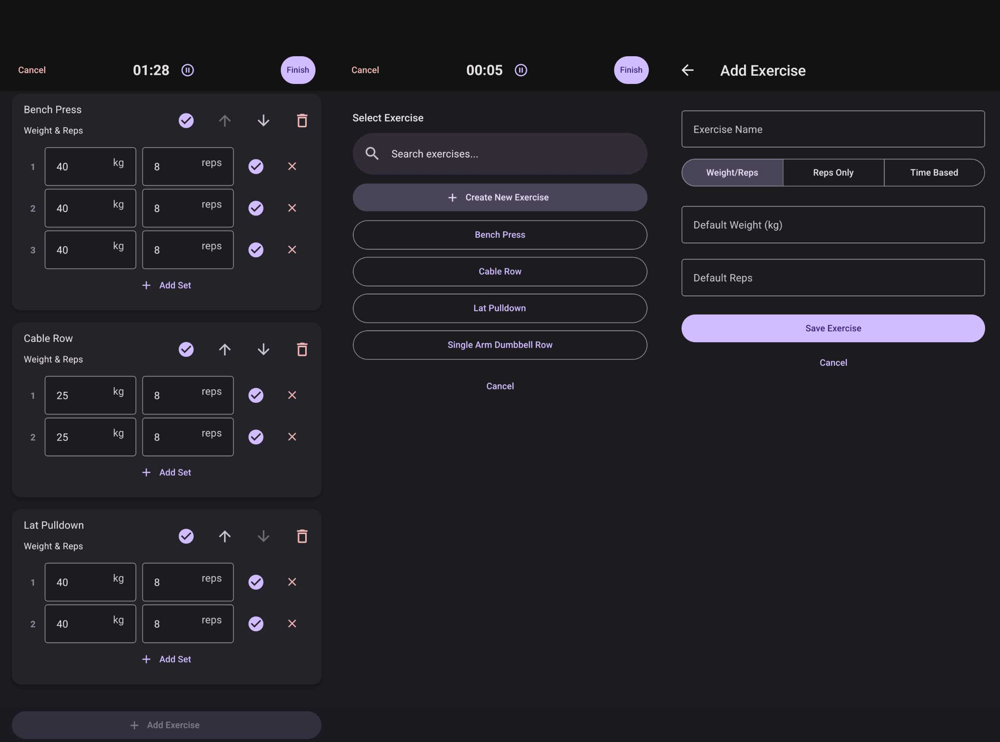

# Fitness Tracker



A local-first fitness tracking mobile application built with React Native and Expo. Track your workouts, manage exercises, and log your progress with an intuitive user interface.

## Features

- **Local First Database**: Powered by Expo SQLite and Drizzle ORM for lightning-fast, offline-capable data storage.
- **Workout Tracking**: Log sets, reps, and weights for various exercises.
- **Exercise Library**: Manage your custom exercise list.
- **Modern UI**: Built with React Native Paper for a clean, accessible, and beautiful Material Design interface.
- **State Management**: Uses Zustand for simple and predictable state management.
- **Cross-Platform**: Runs on Android and iOS (via Expo).

## Tech Stack

- **Framework**: [React Native](https://reactnative.dev/) & [Expo](https://expo.dev/)
- **Navigation**: [Expo Router](https://docs.expo.dev/router/introduction/)
- **Database**: [Drizzle ORM](https://orm.drizzle.team/) & `expo-sqlite`
- **UI Components**: [React Native Paper](https://callstack.github.io/react-native-paper/)
- **State Management**: [Zustand](https://github.com/pmndrs/zustand)

## Getting Started

### Prerequisites

- Node.js (v18+)
- npm or yarn
- Expo CLI
- Android Studio / Xcode (for local emulation) or Expo Go app on your physical device

### Installation

1. Clone the repository:
   ```bash
   git clone git@github.com:charltona/fitness-tracker.git
   cd fitness-tracker
   ```

2. Install dependencies:
   ```bash
   npm install
   ```

3. Run the development server:
   ```bash
   npx expo start
   ```
   Or run directly on Android/iOS:
   ```bash
   npx expo run:android
   # or
   npx expo run:ios
   ```

## Project Structure

- `/app` - Expo Router screens and layouts
- `/components` - Reusable React components
- `/db` - Drizzle ORM schema and database configuration
- `/store` - Zustand state stores
- `/utils` - Helper functions and utilities

## License

MIT License
